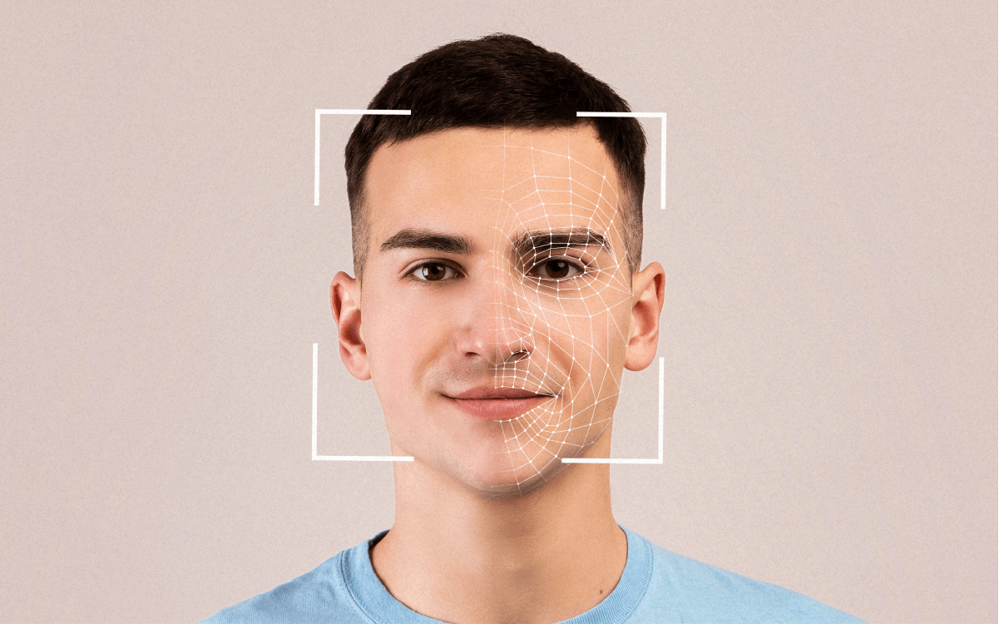

# Compose Face Detection App

Android'in Jetpack Compose framework'ü kullanılarak geliştirilmiş bir yüz tespiti uygulamasıdır. Uygulama, cihazın kamerasını kullanarak gerçek zamanlı yüz tespiti yapabilmektedir.

## Ekran Görüntüleri

  

## Özellikler

- Gerçek zamanlı yüz tespiti
- Modern Jetpack Compose UI
- Kamera entegrasyonu
- Yüz tespiti sonuçlarının görselleştirilmesi

## Teknolojiler

- Kotlin
- Jetpack Compose
- CameraX
- ML Kit Face Detection
- Hilt (Dependency Injection)
- Coroutines
- Flow

## İzinler

Uygulama aşağıdaki izinleri kullanmaktadır:
- CAMERA: Yüz tespiti için kamera erişimi
